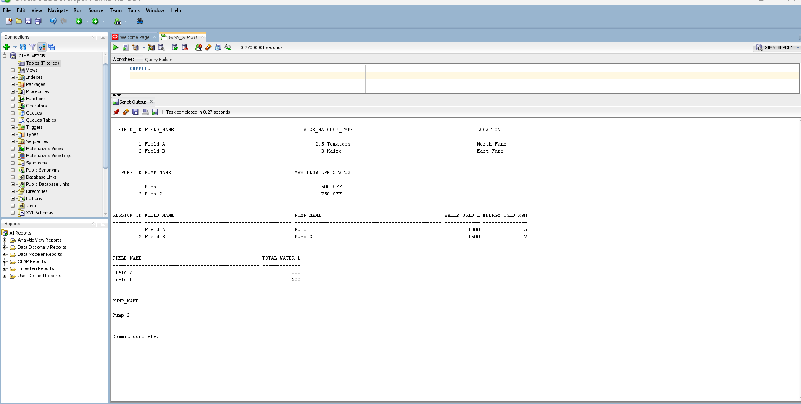
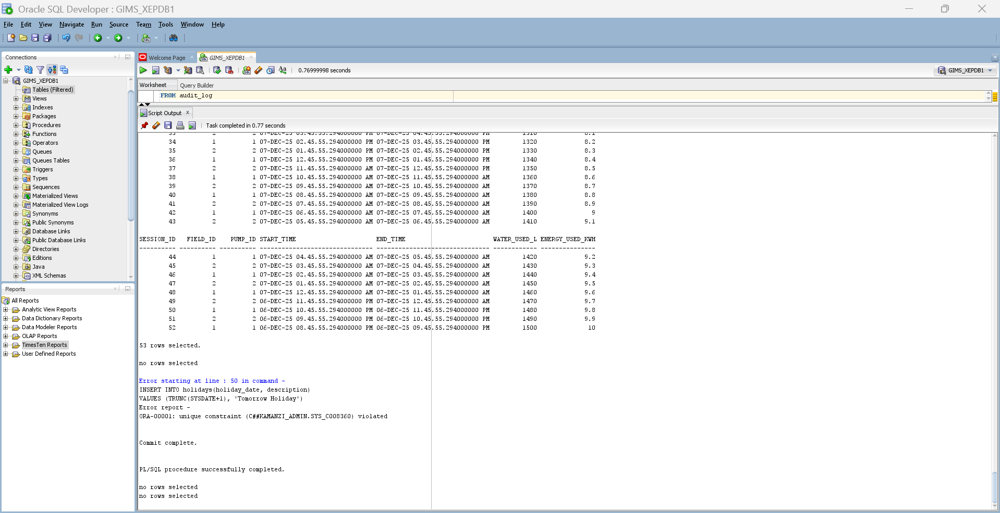

#  Smart Irrigation System – Oracle PL/SQL Capstone Project

This project is a complete Oracle Database & PL/SQL capstone implementation for a **Smart Irrigation Management System**.  
It follows all required phases from **database design to advanced programming, auditing, and business intelligence**.

---

##  Student Information
- **Name:** KAMANZI Milliam
- **ID:** 27523
- **University:** Adventist University of Central Africa (AUCA)  
- **Program:** Software Engineering  
- **Course:** PL/SQL Capstone Project  
- **Year:** 2025  

---

---

#  PHASE I: Problem Definition & System Overview
In this phase, the **Smart Irrigation System** was defined as a solution for:
- Monitoring irrigation sessions
- Tracking water and energy usage
- Managing pumps, fields, and employees
- Enforcing operational restrictions
- Supporting data-driven decision making

The **overall business goals** were documented along with:
- System objectives  
- Stakeholders  
- Expected outputs  

---

#  PHASE II: Logical Database Design
This phase focused on:
- Identifying **entities** (Employees, Fields, Pumps, Sessions, Holidays)
- Defining **attributes** for each entity
- Establishing **relationships**
- Creating the **Entity Relationship Diagram (ERD)**

The logical model defined:
- One field can have many irrigation sessions  
- One pump can serve many sessions  
- Employees manage system operations  

---

#  PHASE III: Physical Database Design
In this phase:
- Logical entities were converted into **Oracle physical tables**
- **Primary Keys and Foreign Keys** were implemented
- **Indexes** were created for performance
- **Constraints** were added (NOT NULL, UNIQUE, CHECK, DEFAULT)

All tables were optimized for real production usage.

---

#  PHASE IV: Database User & Security Configuration
This phase handled:
- Creation of the **Admin Database User**
- Assignment of:
  - CREATE SESSION  
  - CREATE TABLE  
  - CREATE PROCEDURE  
  - CREATE TRIGGER  
  - CREATE VIEW  
- Tablespaces configuration  
- Proper PDB connection in Oracle XE  

This ensured **secure access and proper user isolation**.

---

#  PHASE V: Table Implementation & Data Insertion
This phase included:
- Full creation of all system tables
- Enforcement of **referential integrity**
- Insertion of **100–500+ realistic records** using:
  - Loops
  - FORALL bulk operations
- Inclusion of:
  - Edge cases
  - NULL values
  - Valid and invalid test scenarios

Data integrity was verified using:
- SELECT validation queries  
- Foreign key tests  
- Constraint validation  

---

#  PHASE VI: Database Interaction & Transactions (PL/SQL)
This phase implemented:
###  Procedures (CRUD operations)
- Insert irrigation sessions
- Update session data
- Delete old sessions
- Exception handling implemented

###  Functions
- Validation functions
- Calculation functions
- Lookup functions

###  Cursors & Bulk Operations
- Explicit cursors
- FORALL optimization for performance

###  Window Functions
- ROW_NUMBER()
- RANK()
- LAG() and LEAD()
- PARTITION BY usage

###  Packages
- Grouped related procedures and functions
- Clear separation of specification and body

---

#  PHASE VII: Advanced Programming & Auditing
This phase implemented **real-world business rules** using triggers and auditing.

###  Critical Restriction Rule
Employees are **NOT allowed to INSERT, UPDATE, or DELETE**:
- On **Weekdays (Monday–Friday)**
- On **Public Holidays (Next 30 Days)**

###  Implemented Components
- Holiday Management Table
- Restriction Check Function
- Audit Logging Table
- Audit Logging Procedure
- Restriction Trigger
- Compound Audit Trigger

###  Trigger Testing
-  Weekday insert → **DENIED**
-  Weekend insert → **ALLOWED**
-  Holiday insert → **DENIED**
-  Audit log captures:
  - Username
  - Action type
  - Date
  - Status (ALLOWED / DENIED)
  - Reason

---

#  PHASE VIII: System Testing & Validation
This phase verified:
- All procedures and functions work correctly
- All triggers fire correctly
- All audit logs are recorded properly
- All business rules are enforced
- All exception handling works

Test evidence is included in the `/tests` folder.

---

#  PHASE IX: Business Intelligence (BI)
This phase focused on **decision-making dashboards**.

###  KPIs Implemented
- Total irrigation sessions
- Total water usage
- Total energy consumption
- Active pumps
- Audit violations count
- Weekly performance trends

###  Dashboards Created in Excel
- **Executive Dashboard**
- **Audit Dashboard**
- **Performance Dashboard**

Data was extracted from Oracle using SQL queries and visualized using:
- Line charts
- Bar charts
- KPI cards
- Pivot tables

---

#  Final Project Status
 All phases successfully implemented  
 Business rules enforced  
 Auditing fully functional  
 BI dashboards created  
 Ready for academic submission  

---

##  Conclusion

This project successfully demonstrated the full process of database design, implementation, and advanced PL/SQL programming using Oracle Database. From schema creation and data population to triggers, auditing, and business intelligence reporting, each phase was completed as required.

Through this project, I gained strong hands-on experience in:
- Designing relational databases  
- Writing complex SQL and PL/SQL  
- Implementing business rules with triggers  
- Building audit systems  
- Creating KPI and performance reports  

###  Lessons Learned
- How real-world databases enforce security and business rules  
- The importance of data integrity and auditing  
- How PL/SQL improves automation and performance  
- How BI dashboards support decision-making  

###  Q&A
This project is open for review, improvement, and discussion. Any questions, feedback, or suggestions are welcome.

---
**Project By:** Milliam  

